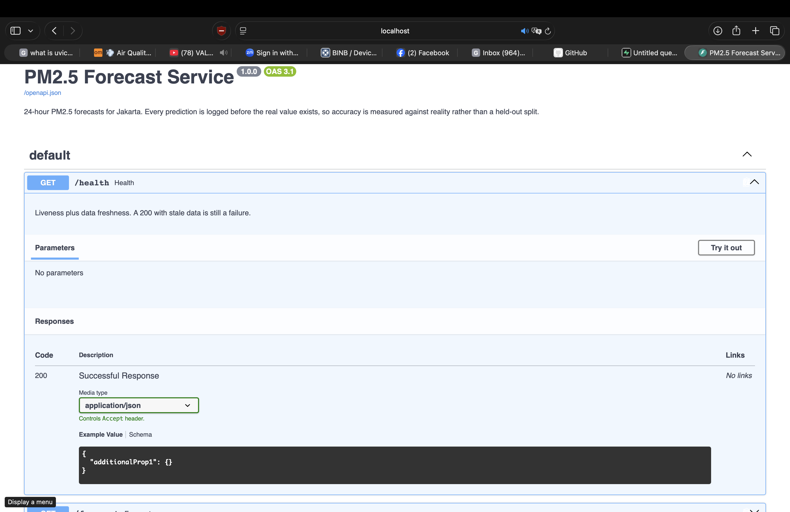

# PM2.5 Forecast Pipeline

A deployed air quality forecaster that logs every prediction **before** the
real value exists, then grades itself when reality catches up.

The model is a ridge regression on lagged values. That is deliberate. The
model is not the project. The project is everything around it: scheduled
ingest, predictions committed in advance, an evaluation gate that can refuse
to promote a worse model, and a dashboard that shows the failures instead of
hiding them.

**Live dashboard → https://pm25-pipeline.streamlit.app**

It reads the production database directly. Block 1 shows how long ago the
last ingest ran; if those ages are small, the pipeline is running right now
without anyone watching it.



## Why the forecasts are written first

Most ML portfolios report a number from a held-out split you cannot verify.
This one writes 24 rows into `forecasts` every hour, each claiming what PM2.5
will be at a future timestamp. Those rows sit there until the matching hour
arrives and `actuals` fills in. Error is never computed at write time, it
appears when the two tables join.

The gap between those two writes is the point. A notebook scores itself on
data it already has. This commits to a number in advance and gets graded by
time, which means nobody can fabricate the result afterwards.

## What the live numbers say

The argument above is only worth making if the numbers are reported whichever
way they come out. As of 2026-09-11, on forecasts written before their hours
happened:

| | MAE (µg/m³) |
|---|---|
| Holdout, at training time | 22.99 |
| Naive baseline, at training time | 30.55 |
| **Live, on scored forecasts** | **25.07** |
| CAMS, same hours | 22.55 |

The model scored 22.99 on a held-out week and 25.07 against reality, and it
is currently losing to CAMS. Two things are worth saying about that.

The first is that the gap between 22.99 and 25.07 is the entire point of the
design. A notebook would have reported 22.99 and stopped. This committed to
predictions before the answers existed and got graded by time, and the two
numbers disagree — which is the normal outcome, and invisible unless you
build the machinery to see it.

The second is that the live figure is still settling. It read 34.51 on 36
scored forecasts, 31.92 on 40, and 25.07 on 55, all within one day. That is a
small sample from a single weather pattern converging, not a model improving.
Any number here should be read with its `n`, and the live dashboard shows
both.

Current values are always at the dashboard link above. The reasoning behind
each figure, and the three bugs found while getting them, is in
[`docs/DECISIONS.md`](docs/DECISIONS.md).

## Architecture

```
Open-Meteo Air Quality API
        │
        │  hourly (GitHub Actions cron)
        ▼
   ingest actuals  ──►  actuals table
   ingest CAMS     ──►  benchmark table
        │
        ▼
   load active model, predict +1h .. +24h
        │
        ▼
   forecasts table  (written before the answer exists)
        │
        ├──►  Supabase REST (views)  →  read-only JSON for clients
        ├──►  FastAPI in Docker      →  /forecast /health /metrics /models
        └──►  Streamlit dashboard    →  reads the forecasts ⋈ actuals join

   weekly (Sunday 03:00 UTC)
        └──►  retrain  →  evaluate on held-out week
                              │
                    beats naive AND beats active?
                       yes ──► promote, redeploy
                       no  ──► register as rejected, keep current model
```

## Quick start

```bash
cp .env.example .env          # add your Postgres URL
pip install -r requirements.txt

python -m src.backfill        # create schema + seed ~3 months of history
python -m src.train           # train, evaluate, promote if it earns it
python -m src.predict         # ingest + write 24 forecasts

uvicorn src.api:app --reload  # http://localhost:8000/docs
streamlit run dashboard/app.py
```

Use Postgres, not SQLite. Serverless containers have ephemeral disks, so a
SQLite file disappears on every redeploy. Supabase and Neon both have free
tiers that handle this write volume comfortably.

## How it is served

The API is built, containerised and verified, but not hosted. Reads go
through Supabase's auto-generated REST endpoint instead:

```
GET /rest/v1/pipeline_metrics   # one row: active version, MAE, n, data age
GET /rest/v1/forecast_latest    # the current 24-point forecast
GET /rest/v1/actuals_recent     # 7 days of observations
GET /rest/v1/mae_by_horizon     # error at +1h through +24h
```

Both Cloud Run and Render require a payment method before running a free
container — anti-abuse verification, not a pricing tier. Nothing in the
pipeline needed either: ingest, forecast and retrain run on GitHub Actions,
and the data lives in Postgres. A deployed API would only have added a public
read path, and Supabase already provides one.

That required locking the database down first. Tables created by
`init_schema()` have RLS disabled, so any holder of the publishable key — a
key that ships inside a client binary — could have written to `forecasts`,
which would destroy the one claim this project makes. RLS is now enabled on
all four tables with no policies at all, and the four views above are the
only public surface. The hourly job is unaffected: it connects as the table
owner, and owners bypass RLS.

The FastAPI service still runs in Docker and still computes what raw
PostgREST cannot. `docker run -p 8080:8080 --env-file .env pm25` is the
documented way to bring it up.

## The evaluation gate

In `src/train.py`. A candidate model must clear two bars before it is allowed
to replace what is serving:

1. Beat the naive baseline (same hour last week) on the held-out week
2. Beat the currently active model's held-out MAE

Fail either and it is registered with `status = 'rejected'` and the active
model is untouched. Rejected rows are never deleted. They are the audit trail
showing the gate turned something down while nobody was watching, and they
render in block 6 of the dashboard.

This is the difference between DevOps and MLOps in one function. Code either
compiles or it does not. A model always "works", so something has to be
willing to reject one for being merely unremarkable.

## Telling decay from a hard week

A rise in error is ambiguous on its own. The model may have decayed, or that
week may have been genuinely unpredictable for everyone (a fire, an inversion
event). You cannot tell from your own numbers.

So the pipeline keeps two references that live through the same weeks: the
naive baseline, and CAMS, which is ECMWF's operational forecast. If all three
degrade together, the week was hard. If only ours does, the problem is ours.
That is why block 5 of the dashboard is a diagnostic and not a vanity chart.

## Dashboard

Six blocks, one scrolling page, health first:

1. **Pipeline health** — last pull, last forecast, last retrain, pending count
2. **Next 24 hours** — the current forecast
3. **Forecast vs actual** — last 7 days, the two lines written at different times
4. **Error over time** — rolling MAE, coloured by model version
5. **Leaderboard** — this model vs naive vs CAMS on the same window
6. **Model history** — every version, rejected ones included

Health goes first because the reader's actual question is "is this live or is
this a screenshot", and a moving timestamp answers it faster than any chart.

## What this does not do

Named deliberately, not overlooked:

- **No feature store.** One univariate series does not need one.
- **No orchestration DAG.** Airflow and Prefect solve coordination problems
  that do not exist with a single hourly job.
- **No hosted model registry.** `models.status` is one column and does the job
  at this scale.
- **No canary rollout.** Promotion is all-or-nothing. Real systems shift
  traffic gradually and roll back automatically.
- **No deep learning.** A ridge regression on lags is a fair fight against the
  baseline, and swapping it out is the easy part by design.
- **No weather features.** The model sees only its own history — lags,
  rolling statistics, calendar encodings. Boundary layer height, wind speed
  and precipitation drive PM2.5 dispersion and would very likely help, but
  adding them means storing *forecast* weather rather than observed, or the
  holdout score is leakage. Deferred until there is a stable production
  baseline to measure the change against. Reasoning in
  [`docs/DECISIONS.md`](docs/DECISIONS.md).
- **Ground truth is a model, not a measurement.** `actuals` comes from
  Open-Meteo's air-quality API, which resolves to CAMS outside Europe. So
  every error figure here is forecast skill measured against CAMS's own later
  analysis, not against instruments. Switching to station data (OpenAQ) would
  be more truthful and changes none of the mechanics this project
  demonstrates.

## Known failure modes

- GitHub disables scheduled workflows on repos inactive for about 60 days.
  This is the first thing that breaks if the project is left alone. It shows
  up as a stale timestamp in block 1, not as an error.
- Supabase pauses free projects after a week without activity. The hourly
  cron prevents this, which means the cron failing has a second, delayed
  consequence beyond missing data.
- Streamlit Community Cloud sleeps an app that goes unvisited, so the first
  load after a quiet period takes a few seconds. The pipeline keeps running
  regardless; only the view of it sleeps.

All three are silent failures. The service keeps returning 200 and the charts
keep rendering, they just stop being about the present. That is why block 1
shows ages rather than a status light.

## Next steps

- **On-device with Core ML.** Converting via `coremltools` moves inference to
  the phone: no latency, works offline, no serving cost. But it inverts the
  deployment problem. Instead of one model behind one URL, there are N copies
  across devices updating on their own schedules, so several versions are live
  at once and rollback becomes publish-and-wait. Accuracy data would have to
  come back as batched telemetry, which raises consent questions the server
  version never has.
- Canary rollout with automatic rollback on error regression
- MLflow for real experiment tracking once there is more than one model family
- A PyTorch LSTM as v2, exported to ONNX so the serving container never
  imports torch
